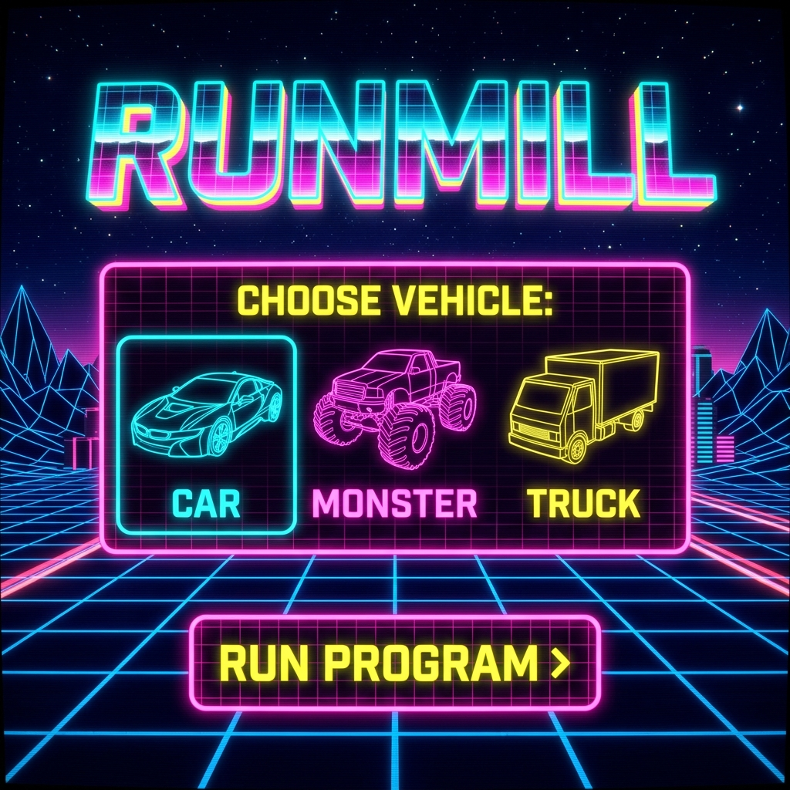
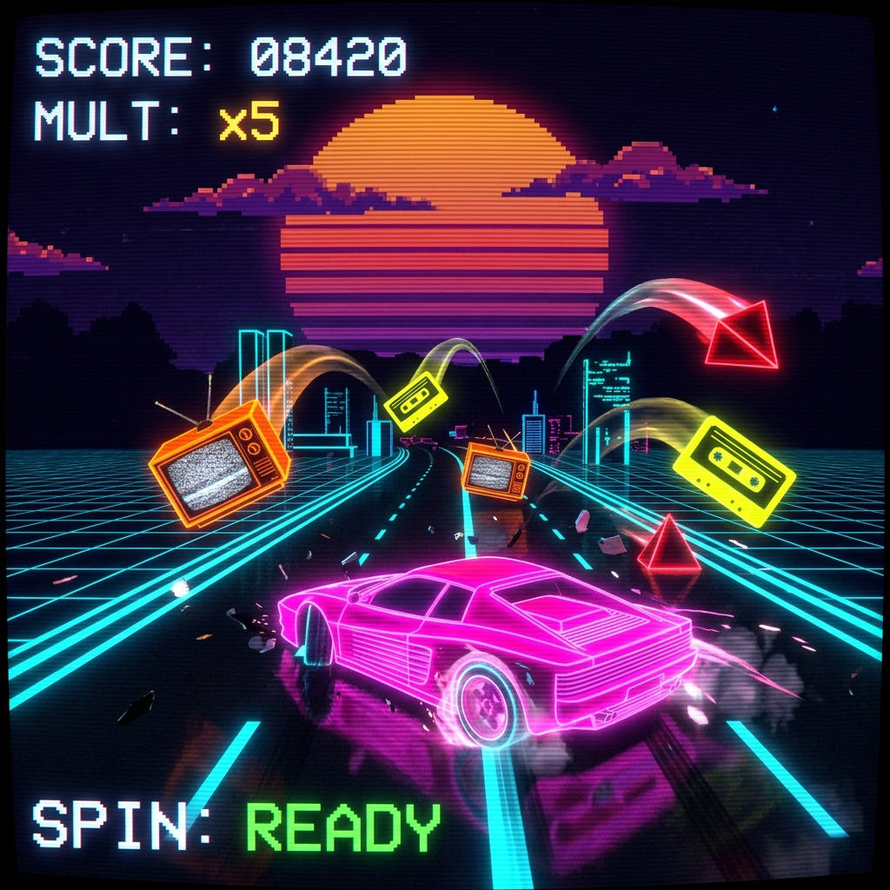

# RUNMILL - 3D 8-Bit Cyber-Grid Runner



**RUNMILL** is a premium 3D retro arcade-style runner game featuring a 90s cyber-grid and neon synthwave aesthetic. Built with Three.js (WebGL) for flat-shaded voxel rendering, procedural Web Audio synthesizer loops, and a lightweight Node/Express backend with persistent leaderboard storage.

---

## Gameplay Screenshot



---

## 🎮 How to Play

1. **Launch Program**: Select your vehicle from the Start Menu and click **RUN PROGRAM** (or press Space/Enter).
2. **Move Lanes**: Press `←` / `A` to move left, and `→` / `D` to move right.
3. **Jump**: Press `SPACE` / `W` / `↑` to jump over low-lying obstacles.
4. **Special Ability**: Press `↓` / `S` to trigger your vehicle's custom weapon/attack (when ready).
5. **Mobile Controls**: Use the on-screen left/right arrow buttons, `JUMP` button, and context-sensitive `BASH`/`SPIN` action button.

---

## 🚗 Choose Your Vehicle

Each vehicle features its own procedural voxel geometry, custom dimensions, rigid physics bounding box, and special characteristics:

| Vehicle | Speed | HP | Special Ability | Description |
| :--- | :---: | :---: | :--- | :--- |
| **SPORTS CAR** | Fast | 3 | **Spin Proximity Fling** | Performs a $720^\circ$ Y-axis tire screech spin. Flinges any obstacles or points within a **2.8-unit** radius up into the air. |
| **MONSTER TRUCK** | Medium | 4 | **Forward Bash Surge** | Nose-dives and surges forward by 1.5 units, knocking out and launching any obstacles hit on impact. |
| **DELIVERY TRUCK** | Heavy | 6 | *None* | A robust, heavy-profile vehicle with massive HP to absorb multiple collisions, but lacks a special ability. |

---

## 📝 Game Rules & Mechanics

### 1. Collect Points & Build Multipliers
- Collect **Floppy Disks** (glowing retro disks) to gain score points and increase your **score multiplier**.
- Multipliers decay over time, so keep collecting to maintain high scoring rates.

### 2. Avoid Hazards
- Avoid crashing into obstacles:
  - **pyramid Spikes** (neon fluorescent crimson red)
  - **CRT TVs** (neon orange frame with yellow static screen)
  - **Cassette Tapes** (neon yellow case with hot pink spools)
- Hitting an obstacle reduces your HP hearts and triggers temporary invincibility frames. Reaching 0 HP terminates the run.

### 3. Lane Landing Physics Trajectories
- Flung items (whether knocked out by a **Bash** or a **Spin**) fly in 3D parabolic arcs under gravity ($g = -25$ m/s$^2$).
- Trajectories are mathematically calculated to land **exactly on the centerlines of the three highway lanes** ($X \in [-2.0, 0, 2.0]$) so they remain reachable and within bounds for you to interact with them.

### 4. Cascade Ground-Impact Explosions
- When a flung obstacle lands, it is removed from the scene and triggers a retro voxel shrapnel explosion (16 glowing cubes).
- The ground impact creates a **6.0-unit blastwave** that flings nearby obstacles and floppy disks forward along their respective lanes, enabling chain-reaction cascade events.

### 5. High Scores Upload
- If you beat the current runners, you'll unlock the **High Score Upload** form. Enter your 3-character initials to submit your score directly to the online leaderboard database.

---

## 🛠️ Technical Architecture

- **Frontend Engine**: `Three.js` (WebGL WebGLRenderer) using custom procedural box geometry meshes, linear lane-swapping interpolations (`lerp`), and parabolic vector kinematics.
- **Audio Synthesizer**: Uses standard Web Audio API oscillators, high/low-pass filters, and gain nodes to generate **100% procedural retro sound effects** and background synth beats dynamically in real-time.
- **Backend Service**: `Express` server serving static build assets in production and exposing API endpoints (`GET /api/scores` and `POST /api/scores`) to read/write leaderboard data stored in a local JSON structure.

---

## 🚀 Getting Started

### Prerequisites
Make sure you have [Node.js](https://nodejs.org/) installed.

### Installation
1. Clone this repository to your local machine.
2. Run the dependency installer:
   ```bash
   npm install
   ```

### Running Locally (Vite Dev Mode)
Start the Vite hot-reloading development server on port `3000`:
```bash
npm run dev
```

### Building for Production
Compile optimized production assets inside the `/dist` directory:
```bash
npm run build
```

### Running Production Server
Start the Express server on port `3001` serving production assets:
```bash
npm start
```
